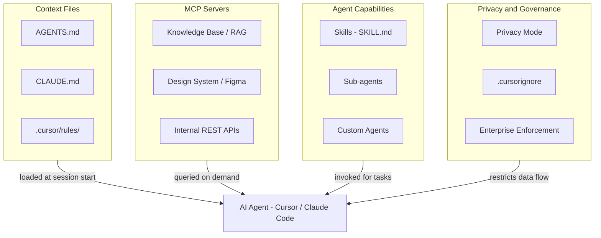

# AI Integration & Development Context Research

Recommendations for maintaining AI context, rules, and development processes, and for furnishing AI models with team-specific knowledge, tools, and privacy controls.

---

## Summary

This document covers: (1) context management via CLAUDE.md, Cursor Rules, and AGENTS.md, (2) internal MCP servers for exposing tools and knowledge to AI agents, (3) agent skills for encoding team-specific procedures, (4) tool calls for design and functionality info, (5) sub-agents for parallel task delegation, and (6) privacy mode and data governance in Cursor.

**End-to-end flow:**

- **Context files:** Layer AGENTS.md (universal) + CLAUDE.md (Claude Code) + `.cursor/rules/` (Cursor) so every AI session starts with the project's tech stack, conventions, commands, and boundaries.
- **Internal MCPs:** Expose knowledge bases, design systems, and internal APIs as MCP servers so the AI agent can query live project data instead of relying on stale context.
- **Skills:** Package repeatable, task-specific procedures (e.g. "create a new API endpoint our way") as SKILL.md files that load on demand without bloating the context window.
- **Sub-agents:** Delegate context-heavy, multi-step tasks to specialized sub-agents (explore, bash, browser, or custom) that run in parallel with their own context windows.
- **Privacy:** Enable Privacy Mode and `.cursorignore` for sensitive projects; enforce at the org level for compliance (SOC 2, HIPAA, NDA).

**How these layers interact:**

```
┌─────────────────────────────────────────────────────────────────────────────┐
│                     AI DEVELOPMENT CONTEXT STACK                            │
└─────────────────────────────────────────────────────────────────────────────┘

  Layer 1: Context Files           Layer 2: MCP Servers         Layer 3: Agent
  ─────────────────────            ──────────────────           ──────────────
  AGENTS.md (universal)            Knowledge base (RAG)         Skills (SKILL.md)
  CLAUDE.md (Claude Code)          Design system (Figma MCP)    Sub-agents
  .cursor/rules/ (Cursor)          Internal APIs (REST adapter) Custom agents
  .cursor/skills/ (Skills)         Browser automation (MCP)

  ──────────────────────────────────────────────────────────────────────────
  Cross-cutting: Privacy Mode · .cursorignore · Enterprise enforcement
  ──────────────────────────────────────────────────────────────────────────
```

**Mermaid diagram:**



---

## Context management

### CLAUDE.md

CLAUDE.md is a persistent markdown file that Claude Code automatically reads at the start of every session. It acts as an onboarding document for your AI pair programmer, replacing the need to repeat project instructions each time.

**File hierarchy (highest to lowest priority):**

| Location               | Scope                     | Shared via Git       | Notes                                     |
| ---------------------- | ------------------------- | -------------------- | ----------------------------------------- |
| `~/.claude/CLAUDE.md`  | User-level (all projects) | No                   | Personal defaults across all repos.       |
| `./CLAUDE.md`          | Project root              | Yes                  | Primary project context; commit to repo.  |
| `./.claude/CLAUDE.md`  | Project-specific          | Yes                  | Alternative project-level location.       |
| `./CLAUDE.local.md`    | Personal preferences      | No (auto-gitignored) | Per-developer overrides.                  |
| `./.claude/rules/*.md` | Scoped, domain-specific   | Yes                  | Conditional rules loaded by file pattern. |

Child-directory CLAUDE.md files load on-demand (not at startup) when the agent works in that directory.

**Best practices:**

- Keep the root file under 300 lines. Frontier LLMs reliably follow 150-200 instructions; Claude Code's system prompt consumes ~50, leaving 100-150 for your rules.
- Hand-craft every line. Never use `/init` auto-generation; bad instructions compound across every task.
- Use `.claude/rules/` for domain-specific instructions (e.g. `backend.md`, `testing.md`) that load conditionally instead of cluttering the main file.
- Include: tech stack, architecture overview, coding standards, file structure, build/test commands, error-handling patterns.
- Use a "Current Focus" section for session-specific context.

**Impact:** Developers with proper CLAUDE.md context complete tasks up to 55% faster.

### Cursor Rules (.cursor/rules/)

Cursor Rules are persistent, reusable instructions that inject consistent context at the start of every model interaction. The modern system uses a `.cursor/rules/` directory with multiple files instead of a single legacy `.cursorrules` file.

**File formats:**

- `.md` files: plain markdown.
- `.mdc` files: markdown with YAML frontmatter for metadata (`description`, `globs`, `alwaysApply`).

**Activation modes:**

| Mode                        | When it loads                               | Use case                                                  |
| --------------------------- | ------------------------------------------- | --------------------------------------------------------- |
| **Always Apply**            | Every chat session                          | Core conventions, tech stack, coding style.               |
| **Apply Intelligently**     | Agent determines relevance from description | Domain rules the agent should pick up when relevant.      |
| **Apply to Specific Files** | Matched by glob pattern                     | File-type rules (e.g. `*.test.ts` → testing conventions). |
| **Apply Manually**          | Invoked with @-mention in chat              | Rarely used procedures invoked on demand.                 |

**Best practices:**

- Write imperative, minimal instructions (avoid prose).
- Scope narrowly using file patterns or keywords.
- Provide micro-examples to improve compliance.
- Assign priorities (1-100) to prevent conflicts between overlapping rules.
- Treat rule changes as code changes requiring PR review.
- Start simple; add rules only when you notice the AI making repeated mistakes.
- Keep individual rules under 500 lines; do not duplicate code already in the repo.

**Recommended organization:**

```
.cursor/rules/
├── core.md            # Tech stack, architecture, conventions
├── backend.md         # API patterns, database access, error handling
├── frontend.md        # Component patterns, state management, styling
├── testing.md         # Test structure, mocking, coverage requirements
└── security.md        # Auth patterns, input validation, secrets handling
```

### AGENTS.md

AGENTS.md is an emerging universal standard for AI agent context, stewarded by the Agentic AI Foundation under the Linux Foundation. Over 60,000 GitHub projects use this format as of early 2026. It is a plain markdown file in the project root with no frontmatter, making it the simplest and most portable option.

**What to include (six core areas):**

1. **Commands** — Build, test, lint, and deploy commands with full flags, listed early in the file.
2. **Testing** — Test framework, naming conventions, coverage expectations.
3. **Project structure** — Directory layout and where to find key modules.
4. **Code style** — Formatting, naming, import ordering, error handling patterns.
5. **Git workflow** — Branch naming, commit conventions, PR process.
6. **Boundaries** — What the agent should never touch or modify.

**Key principle:** AGENTS.md targets machines, not humans. Use precise step-by-step instructions and exact commands; replace prose with code examples wherever possible.

### Comparison

| Aspect             | CLAUDE.md                                    | .cursor/rules/                                  | AGENTS.md                                                       |
| ------------------ | -------------------------------------------- | ----------------------------------------------- | --------------------------------------------------------------- |
| **Tool support**   | Claude Code                                  | Cursor                                          | Universal (Cursor, Claude Code, Codex CLI, Copilot, Gemini CLI) |
| **File format**    | Markdown                                     | Markdown or MDC (with YAML frontmatter)         | Plain Markdown                                                  |
| **Auto-discovery** | Yes (session start)                          | Yes (session start or on-demand by glob)        | Yes (session start)                                             |
| **Scoping**        | File hierarchy + `.claude/rules/` globs      | Four activation modes including glob matching   | Single file, no conditional loading                             |
| **Team sharing**   | Git (except `.local.md`)                     | Git                                             | Git                                                             |
| **Granularity**    | Multi-file hierarchy                         | Multi-file with per-rule metadata               | Single file                                                     |
| **Best for**       | Claude Code-specific features, modular rules | Cursor-specific features, glob-based activation | Cross-tool compatibility, simplest setup                        |

### Recommended strategy

Layer all three for maximum coverage:

1. **AGENTS.md** as the universal foundation — works across all AI coding tools; contains commands, project structure, code style, boundaries.
2. **`.cursor/rules/`** for Cursor-specific features — glob-based activation, intelligent apply, priority levels.
3. **CLAUDE.md** for Claude Code-specific features — file hierarchy, scoped `.claude/rules/`, personal `.local.md`.
4. **`.local.md` / personal rules** for individual developer preferences — gitignored, not shared.

Avoid duplicating content across files. Put shared conventions in AGENTS.md, and only add tool-specific instructions to the platform files.

### Examples based on this codebase

The following are concrete examples of what each context file would look like for this pnpm monorepo (Next.js 16, Drizzle ORM, Zod contracts, multi-tenant RLS).

**Example AGENTS.md (project root — universal, all AI tools):**

```markdown
# AGENTS.md

## Commands

pnpm install # install all workspace deps
pnpm dev # start Next.js dev server (Turbopack)
pnpm build # build all packages then web app
pnpm build:packages # build only packages/\* (tsc)
pnpm lint # eslint via next
pnpm typecheck # build packages + tsc --noEmit across repo
pnpm test # run API tests
pnpm format # prettier --write .
pnpm format:check # prettier --check .
pnpm generate:openapi # regenerate openapi.json from Zod schemas
pnpm check:contracts # verify contracted routes import from @repo/api-contracts
pnpm db:generate # drizzle-kit generate migrations
pnpm db:migrate # run migrations
pnpm db:push # push schema to DB
pnpm db:seed # seed database
pnpm db:apply-rls # apply row-level security policies
pnpm db:bootstrap-migrations # bootstrap drizzle migration metadata

## Project structure

apps/web/ # Next.js 16 app (routes, components, API handlers)
packages/api-contracts/ # Zod schemas + OpenAPI generation (source of truth for API shape)
packages/auth/ # BetterAuth (email/password, two-factor, magic link, Drizzle adapter)
packages/core/ # Business logic (use-case functions, no HTTP types)
packages/db/ # Drizzle ORM schema, client, tenant helper
docs/ # Architecture plans and research
scripts/ # Repo-level scripts (check-contract-usage.mjs)

## Code style

- TypeScript strict mode everywhere.
- Prettier for formatting; enforced via husky + lint-staged on pre-commit.
- Zod for all input/output validation; schemas live in @repo/api-contracts.
- Tables: plural (users, reminders, tenants). Columns: camelCase in code, snake_case in DB.
- Functions: camelCase (createUser, listUsers). Errors: Core\*Error (CoreNotFoundError, CoreConflictError).
- Schemas: \*Schema suffix (CreateUserBodySchema, UserResponseSchema).
- Barrel exports in each package index.ts; no subpath exports.

## Architecture rules

- Contract-first: define Zod schemas in @repo/api-contracts BEFORE writing handlers.
- Core layer (@repo/core) contains business logic. Functions take (tenantId, ...) and call withTenant(). No HTTP types (Request, Response, NextRequest) in core.
- API handlers wrap with withAuth() from @/lib/with-auth.ts — it resolves auth + tenant and catches errors. Do NOT call getCurrentUser/getTenantId manually in route files.
- Validation: use .safeParse() on contract schemas; on failure call validationError() from @/lib/errors.ts.
- Serialization: pass core results through serializeUser() or serializeReminder() from @/lib/validations/ before returning responses. Use validateResponse() for contracted response shapes.
- Error helpers: use notFound(), conflict(), unauthorized(), validationError() from @/lib/errors.ts. Do NOT construct NextResponse.json({ error }) manually.
- Multi-tenancy: withTenant(tenantId, callback) sets app.current_tenant_id; RLS policies enforce isolation on users and reminders tables.
- Auth: BetterAuth handles sessions, accounts, verification, and two-factor. Auth routes live at apps/web/src/app/api/auth/[...all]/route.ts.
- Error mapping: CoreNotFoundError → notFound(), CoreConflictError → conflict(), Zod failure → validationError(), unauthenticated → unauthorized().

## Git workflow

- Branch naming: feature/<ticket>-short-name, fix/<ticket>-short-name.
- Conventional commits (feat:, fix:, chore:, docs:) — enforced by commitlint.
- Husky + lint-staged: prettier runs on staged files before each commit.
- Squash merge to main.

## Boundaries

- NEVER import from apps/web inside packages/\*.
- NEVER use raw SQL in @repo/core; always use Drizzle query builder.
- NEVER commit .env files or real credentials.
- NEVER modify packages/db/drizzle/ migration files after they have been applied.
- NEVER add HTTP types (Request, Response, NextRequest) to @repo/core.
- NEVER modify BetterAuth-managed tables (sessions, accounts, verifications, two_factors) directly via Drizzle; use the BetterAuth API in @repo/auth instead.
```

**Example CLAUDE.md (project root — Claude Code-specific):**

```markdown
# CLAUDE.md

This is a pnpm monorepo: Next.js 16 + Drizzle ORM + Zod contracts + BetterAuth + multi-tenant RLS on Neon Postgres.

## Quick reference

See AGENTS.md for commands, project structure, code style, and boundaries — all of those apply here.

## Claude-specific instructions

- When creating a new API route, read docs/contract-first-agent-guide.md first and follow it exactly.
- All route handlers must use the withAuth() wrapper from @/lib/with-auth.ts. Never call getCurrentUser/getTenantId directly in route files.
- When modifying DB schema, run `pnpm db:generate` after changes to create a migration, then `pnpm db:migrate`.
- When adding a new Zod schema to @repo/api-contracts, re-export it from packages/api-contracts/src/index.ts and run `pnpm generate:openapi`.
- After changing any package under packages/\*, run `pnpm build:packages` to rebuild packages, or `pnpm build` to rebuild everything.
- Run `pnpm format` before committing, or rely on the husky pre-commit hook to auto-format staged files.
- For BetterAuth changes, see docs/data-migration-betterauth.md for migration context.

## Current focus

BetterAuth integration and multi-tenancy hardening: ensuring all @repo/core functions use withTenant() and RLS policies are applied to every tenant-scoped table.
```

**Example `.claude/rules/api-handlers.md` (scoped rule for Claude Code):**

```markdown
# Rule: API route handlers

Applies when working on files in apps/web/src/app/api/.

1. Wrap every exported handler with withAuth() from @/lib/with-auth.ts. The wrapper provides { currentUser, tenantId } and handles auth/error boilerplate.
2. Import request/response schemas from @repo/api-contracts.
3. Use .safeParse() for body validation; on failure call validationError(parsed.error) from @/lib/errors.ts.
4. Delegate to @repo/core functions; do not put business logic in the handler.
5. Serialize results through serializeUser() or serializeReminder() from @/lib/validations/ before returning.
6. Use validateResponse(Schema, data) for contracted response shapes.
7. Use error helpers from @/lib/errors.ts: notFound(), conflict(), unauthorized(). Do not construct error responses manually.
```

**Example `.cursor/rules/core.mdc` (always-apply — Cursor-specific):**

```markdown
---
description: Core project conventions for the pnpm monorepo
globs:
alwaysApply: true
---

# Core conventions

- This is a pnpm monorepo: apps/web (Next.js 16), packages/api-contracts (Zod), packages/auth (BetterAuth), packages/core (business logic), packages/db (Drizzle ORM on Neon Postgres).
- TypeScript strict. Zod for validation. Drizzle for DB access. Multi-tenant via RLS. Prettier for formatting.
- Contract-first API: Zod schemas in @repo/api-contracts are the source of truth.
- API handlers use withAuth() wrapper from @/lib/with-auth.ts for auth + tenant resolution.
- Core functions take (tenantId, ...) and use withTenant(). No HTTP types in @repo/core.
- Error helpers from @/lib/errors.ts: notFound(), conflict(), unauthorized(), validationError().
- Serializers from @/lib/validations/: serializeUser(), serializeReminder().
- Tables plural, columns camelCase in code / snake_case in DB.
- Functions camelCase, errors Core*Error, schemas *Schema suffix.
- Conventional commits enforced by commitlint; prettier on pre-commit via husky + lint-staged.
```

**Example `.cursor/rules/api-routes.mdc` (glob-scoped — Cursor-specific):**

```markdown
---
description: Rules for Next.js API route handlers
globs: apps/web/src/app/api/**/*.ts
alwaysApply: false
---

# API route handler conventions

- Wrap every exported handler with withAuth() from @/lib/with-auth.ts. It provides { currentUser, tenantId } and handles auth + top-level errors.
- Import schemas from @repo/api-contracts. Use .safeParse() for validation; on failure call validationError() from @/lib/errors.ts.
- Call @repo/core functions for business logic; keep handlers thin.
- Serialize results with serializeUser() or serializeReminder() from @/lib/validations/ before returning.
- Use validateResponse(Schema, data) for contracted response shapes.
- Error handling: catch CoreNotFoundError → notFound(), CoreConflictError → conflict() from @/lib/errors.ts. Let unexpected errors propagate to the withAuth wrapper.

Example handler structure:

import { NextRequest, NextResponse } from "next/server";
import { CreateUserBodySchema, UserResponseSchema } from "@repo/api-contracts";
import { createUser, CoreConflictError } from "@repo/core";
import { validationError, conflict } from "@/lib/errors";
import { validateResponse } from "@/lib/validate-response";
import { serializeUser } from "@/lib/validations/users";
import { withAuth } from "@/lib/with-auth";

export const POST = withAuth(async ({ tenantId }, request: NextRequest) => {
const parsed = CreateUserBodySchema.safeParse(await request.json());
if (!parsed.success) return validationError(parsed.error);

try {
const created = await createUser(tenantId, parsed.data);
const body = validateResponse(UserResponseSchema, serializeUser(created));
return NextResponse.json(body, { status: 201 });
} catch (e) {
if (e instanceof CoreConflictError) return conflict(e.message);
throw e;
}
});
```

**Example `.cursor/rules/db-schema.mdc` (glob-scoped — Cursor-specific):**

```markdown
---
description: Rules for Drizzle ORM schema and database changes
globs: packages/db/src/**/*.ts
alwaysApply: false
---

# Database conventions

- Use Drizzle ORM pgTable() for all table definitions.
- Table names: plural (users, reminders, tenants, sessions, accounts, verifications).
- Column mapping: camelCase in TypeScript, snake_case in Postgres (use { mapWith } or explicit .name()).
- Every table with tenant-scoped data MUST have a tenantId column referencing tenants.id.
- After schema changes: run `pnpm db:generate` then `pnpm db:migrate`.
- Never edit existing migration files in packages/db/drizzle/.
- RLS policies: after adding a tenant-scoped table, update the RLS script and run `pnpm db:apply-rls`.
- BetterAuth-managed tables (sessions, accounts, verifications, two_factors) are controlled by @repo/auth. Do NOT modify their structure directly; changes flow through BetterAuth config.
- Enums: reminder_status (pending, completed, dismissed), tenant_plan (free, pro, enterprise), domain_type (subdomain, custom), tenant_role (owner, admin, member).
```

**Example `.cursor/rules/commits.mdc` (always-apply — commit message format for Cursor's sparkle icon):**

```markdown
---
description: Commit message format for AI-generated commits
globs:
alwaysApply: true
---

# Commit message format

Generate commit messages in Conventional Commits format:

type(scope): short description

Types: feat, fix, refactor, docs, test, chore, ci, perf, style
Scope: package or area (api-contracts, core, db, auth, api, web). Omit scope only if change spans many packages.
Description: lowercase, imperative mood, no period, max 72 chars.

Examples:
feat(api): add DELETE /api/reminders/:id endpoint
fix(core): prevent duplicate email on createUser
refactor(db): extract tenant helper into separate module
docs: update PR process with CodeRabbit
chore: upgrade drizzle-orm to 0.45

Multi-line body (optional, for complex changes):
feat(api): add soft-delete for reminders

Set isDeleted=true instead of hard delete.
RLS policies still apply to soft-deleted rows.
```

This rule is read by Cursor when generating commit messages (sparkle icon / `Cmd+M`). Commitlint (`@commitlint/config-conventional`) then validates the result via the husky `commit-msg` hook, rejecting anything that doesn't match the format.

**How these examples layer together (no duplication):**

| Content                                             | Where it lives                  | Why                                                      |
| --------------------------------------------------- | ------------------------------- | -------------------------------------------------------- |
| Commands, project structure, code style, boundaries | AGENTS.md                       | Universal; read by all tools.                            |
| Claude-specific workflow tips, current focus        | CLAUDE.md                       | Only Claude Code reads this.                             |
| Scoped API handler rules for Claude                 | `.claude/rules/api-handlers.md` | Loaded only when Claude works on API files.              |
| Core conventions (always-on) for Cursor             | `.cursor/rules/core.mdc`        | alwaysApply; Cursor-specific metadata.                   |
| Commit message format for Cursor                    | `.cursor/rules/commits.mdc`     | alwaysApply; Cursor reads this when generating commits.  |
| API route rules (glob-scoped) for Cursor            | `.cursor/rules/api-routes.mdc`  | Loaded only when editing `apps/web/src/app/api/**/*.ts`. |
| DB schema rules (glob-scoped) for Cursor            | `.cursor/rules/db-schema.mdc`   | Loaded only when editing `packages/db/src/**/*.ts`.      |

### Governance: creating, updating, and protecting context files

Context files are code. They go through PRs, require designated reviewers, and cannot be changed without approval.

**Creating context files:**

- Have 1-2 senior devs write the initial files based on existing conventions. Do not auto-generate with AI — bad instructions compound across every task.
- Review the initial files as a team PR so everyone agrees on the baseline.
- Start minimal. Add rules only when the AI makes repeated mistakes — each unnecessary instruction degrades performance across all instructions.

**Keeping them updated:**

If a PR changes a convention, it must also update the context files. Two mechanisms enforce this:

1. **CODEOWNERS** — GitHub requires designated reviewers for changes to protected files:

```
# .github/CODEOWNERS
AGENTS.md                    @team-leads
.cursor/rules/               @team-leads
```

Any PR touching those files auto-requests approval from `@team-leads` before merge.

2. **CodeRabbit custom instruction** — flag PRs that change conventions without updating context files:

```yaml
# .coderabbit.yaml
reviews:
  instructions: |
    If this PR introduces a new convention, package, or pattern,
    check whether AGENTS.md or .cursor/rules/ were updated.
    Flag if not.
```

**Restricting access (preventing accidental removal of key instructions):**

GitHub does not support per-file write locks, but CODEOWNERS + branch protection achieves the same effect:

| Mechanism             | What it does                                                                  |
| --------------------- | ----------------------------------------------------------------------------- |
| **CODEOWNERS**        | Requires designated reviewers for changes to `AGENTS.md` and `.cursor/rules/` |
| **Branch protection** | No direct push to `main`; all changes go through PR                           |
| **Required reviews**  | At least 1 approval from a code owner before merge                            |
| **CodeRabbit**        | Flags removals or large changes to context files as high-severity             |

With this setup, someone cannot accidentally remove a key instruction: they cannot push directly to `main` (branch protection), their PR auto-requests review from `@team-leads` (CODEOWNERS), a team lead must approve before merge, and CodeRabbit flags the deletion in its review.

**Suggested ownership model:**

| File                           | Owner                 | Update trigger                              |
| ------------------------------ | --------------------- | ------------------------------------------- |
| `AGENTS.md`                    | Tech lead / architect | New package, convention change, new command |
| `.cursor/rules/core.mdc`       | Tech lead             | Architecture or stack change                |
| `.cursor/rules/commits.mdc`    | Any dev (low risk)    | Commit format change                        |
| `.cursor/rules/api-routes.mdc` | Backend lead          | Handler pattern change                      |
| `.cursor/rules/db-schema.mdc`  | Backend lead          | Schema convention change                    |

---

## Internal MCPs (Model Context Protocol)

### What is MCP

The Model Context Protocol (MCP) is an open standard for connecting AI models to external tools and data sources. It uses JSON-RPC 2.0 communication with two core methods: `tools/list` (returns available tools) and `tools/call` (executes a tool). MCP separates server logic from the transport layer (stdio, SSE, HTTP streaming), enabling flexible deployment.

### Use cases for internal MCP servers

| Use case                      | What it provides to the AI agent                                | Example                                                                                        |
| ----------------------------- | --------------------------------------------------------------- | ---------------------------------------------------------------------------------------------- |
| **Knowledge base / RAG**      | Internal docs, API references, architecture decisions, runbooks | Agent queries "how does our auth flow work?" and gets grounded answers with citations.         |
| **Design system / Figma MCP** | Design tokens, component mappings, Code Connect integration     | Agent generates UI code matching the actual design system instead of guessing.                 |
| **REST API adapter**          | Existing internal services exposed as callable tools            | Agent calls an internal user-lookup or deployment API without the developer switching context. |
| **Database / schema server**  | Live schema info, sample queries, migration history             | Agent writes queries and migrations against the real schema.                                   |

### Figma MCP (design-to-code)

The Figma MCP server exposes design files as structured, machine-readable context. Key capabilities:

- **Code Connect integration:** Maps Figma components to actual codebase components, including import statements, component snippets, and prop mappings.
- **Design context extraction:** Retrieves variables, styles, tokens, and metadata.
- **Design system rules:** Helps AI agents understand spacing, color, and layout constraints.

Available on Dev or Full seats with Professional, Organization, or Enterprise Figma plans.

### Building custom MCP servers

**SDKs:**

- **JavaScript / TypeScript:** `@modelcontextprotocol/sdk` — `McpServer` class as the core abstraction; use `registerTool()` and `registerResource()`.
- **Python:** `mcp` package — full specification support with stdio, SSE, and HTTP transports.

**Debugging:** `npx @modelcontextprotocol/inspector` — interactive tool for testing MCP tools, resources, and prompts with custom inputs.

**Configuration in Cursor:** Add MCP servers in `.cursor/mcp.json` (project-level) or user settings (global). Each entry specifies the server command, arguments, and environment variables.

Example `.cursor/mcp.json`:

```json
{
  "mcpServers": {
    "knowledge-base": {
      "command": "node",
      "args": ["./mcp-servers/knowledge-base/index.js"],
      "env": { "KB_API_KEY": "${KB_API_KEY}" }
    },
    "figma": {
      "command": "npx",
      "args": [
        "-y",
        "figma-developer/figma-mcp",
        "--personal-access-token",
        "${FIGMA_TOKEN}"
      ]
    }
  }
}
```

### Tool architecture for scaling

When an agent has access to many tools (30+), a 3-layer architecture prevents token waste and selection errors:

1. **Base Tools** (always loaded): core functions like file I/O, web search, code execution, memory.
2. **Toolkits** (domain packs): dynamically loaded via keyword matching or embedding similarity (e.g. "design system toolkit", "deployment toolkit").
3. **Tasks** (individual functions): specific tools within toolkits sent to the LLM only when needed.

---

## Skills & specifics

### Agent Skills (SKILL.md)

Agent Skills is an open standard (agentskills.io, December 2025) for teaching AI agents domain-specific tasks. Skills are supported by GitHub Copilot, Claude Code, OpenAI Codex, Cursor, and Google Gemini CLI.

**Structure:**

```
.agents/skills/create-api-endpoint/
├── SKILL.md          # YAML frontmatter + markdown instructions
├── scripts/          # Helper scripts the skill can reference
├── references/       # Example files, templates
└── assets/           # Images, diagrams
```

**SKILL.md format:**

```markdown
---
name: create-api-endpoint
description: >
  Create a new REST API endpoint following our conventions.
  Use when adding a new route to the backend.
---

## Instructions

1. Create the route file in `apps/web/src/app/api/`.
2. Follow the handler pattern in `references/handler-template.ts`.
3. Import Zod schemas from `@repo/api-contracts` for input validation.
4. Call the corresponding `@repo/core` function for business logic.
5. Add integration tests in `apps/web/tests/api/`.
```

**Discovery paths (checked in order):**

| Path                | Scope                              |
| ------------------- | ---------------------------------- |
| `.agents/skills/`   | Project-level (universal standard) |
| `.cursor/skills/`   | Project-level (Cursor-specific)    |
| `~/.cursor/skills/` | User-level / global                |

**Progressive disclosure:** Only skill metadata (name, description) loads initially. Full instructions and referenced files load on-demand when the agent determines a skill is relevant. This prevents context window bloat even with hundreds of installed skills.

**Skills vs Rules:**

| Aspect           | Rules                                          | Skills                                                                                       |
| ---------------- | ---------------------------------------------- | -------------------------------------------------------------------------------------------- |
| **Purpose**      | General project conventions and constraints    | Focused, task-specific "how-to" procedures                                                   |
| **Activation**   | Always or conditionally at session start       | On-demand when relevant to current task                                                      |
| **Scope**        | Broad (coding style, architecture, boundaries) | Narrow (one procedure, one workflow)                                                         |
| **Context cost** | Loaded upfront into context window             | Progressive disclosure; loaded only when needed                                              |
| **Example**      | "Use Zod for all input validation"             | "Step-by-step: create a new API endpoint with Zod validation, tests, and route registration" |

### Tool calls for design and functionality info

MCP servers and skills work together to give the AI agent access to live design and functionality data:

- **Figma MCP server:** Exposes design files as structured context. Code Connect maps Figma components to codebase components so generated code uses real imports and props.
- **Custom MCP tools:** Wrap internal APIs, databases, documentation wikis, or Confluence spaces as callable tools. The agent queries them in real time instead of relying on possibly outdated context files.
- **Design tokens server:** Expose colors, spacing, typography, and breakpoints from the design system as an MCP resource so the agent uses the correct values.

**When to use tool calls vs context files:**

| Scenario                                             | Use context files          | Use MCP tool calls    |
| ---------------------------------------------------- | -------------------------- | --------------------- |
| Static conventions (naming, style, patterns)         | Yes                        | No                    |
| Live data (current schema, design tokens, API docs)  | No                         | Yes                   |
| Large reference sets (component library, migrations) | No (too large for context) | Yes (query on demand) |
| Rarely changing info (tech stack, architecture)      | Yes                        | No                    |

### Sub-agents

Sub-agents, introduced in Cursor 2.4 (January 2026), are specialized AI assistants that handle discrete tasks in parallel with their own context windows.

**Built-in sub-agents:**

| Type        | Purpose                              | Example use                                                    |
| ----------- | ------------------------------------ | -------------------------------------------------------------- |
| **Explore** | Search and analyze codebases         | "Find all usages of the UserService class"                     |
| **Bash**    | Run shell commands                   | "Run the test suite and report failures"                       |
| **Browser** | Control browser interactions via MCP | "Navigate to localhost:3000 and verify the login page renders" |

**Custom sub-agents:** Define in `~/.cursor/agents/` with YAML frontmatter (name, description). Invoked through the Task tool to delegate work.

**Execution modes:**

- **Foreground:** Blocks until completion — use for sequential tasks where the result is needed before proceeding.
- **Background:** Returns immediately — use for parallel or long-running tasks (e.g. running tests while continuing to code).

**When to use sub-agents vs skills:**

| Scenario                                | Use sub-agents | Use skills |
| --------------------------------------- | -------------- | ---------- |
| Multi-step task needing its own context | Yes            | No         |
| Parallel execution across files/systems | Yes            | No         |
| Single-purpose, repeatable procedure    | No             | Yes        |
| Domain knowledge encoding               | No             | Yes        |

**Known limitations (as of early 2026):** Cloud Agents cannot currently invoke sub-agents. The Task tool may not be available in all configurations when sub-agent delegation context is injected.

### Privacy Mode in Cursor

Privacy Mode controls whether code is sent to external AI providers for processing. It is the primary mechanism for protecting sensitive codebases.

**Enabling Privacy Mode:**

1. Open Settings (Ctrl+,).
2. Navigate to the Privacy section.
3. Toggle on "Privacy Mode".

**What Privacy Mode does:**

| Aspect             | Privacy Mode ON                                         | Privacy Mode OFF                           |
| ------------------ | ------------------------------------------------------- | ------------------------------------------ |
| **Data retention** | Zero data retention (ZDR) with all AI providers         | Standard provider retention policies apply |
| **Training**       | Code never used for training by Cursor or third parties | Code not used for training (Cursor policy) |
| **AI features**    | Most AI features disabled or limited                    | Full AI capabilities available             |
| **Best for**       | Proprietary code, NDA, compliance                       | Personal projects, non-sensitive code      |

**`.cursorignore` for granular control:**

Even without full Privacy Mode, exclude sensitive files from all AI features by creating a `.cursorignore` file:

```
# Environment and secrets
.env*
*.pem
*.key
credentials/
secrets/

# Production configs
config/production.*

# Sensitive data
**/fixtures/pii-*
```

Files matching these patterns are blocked from @ mention references, Tab completions, Agent and Inline Edit features, and semantic search.

**Enterprise features:**

| Feature                         | Description                                                                |
| ------------------------------- | -------------------------------------------------------------------------- |
| **Admin-enforced Privacy Mode** | Admins toggle Privacy Mode on; team members cannot disable it.             |
| **MDM policies**                | Prevent users from bypassing Privacy Mode via personal accounts.           |
| **SOC 2 Type II**               | Cursor is SOC 2 Type II certified.                                         |
| **GDPR**                        | Compliant with EU data protection requirements.                            |
| **Encryption**                  | AES-256 at rest, TLS 1.2+ in transit.                                      |
| **CMEK**                        | Customer Managed Encryption Keys available for enterprise.                 |
| **DPA**                         | Data Processing Agreements with comprehensive data protection commitments. |

**Compliance use cases:** HIPAA-regulated development, SOC 2 requirements, client NDA projects, government/defense work.

---

## Benefits and potential issues

### Benefits

- **Consistent AI behavior:** Context files and rules ensure the AI follows the same conventions across every session and every team member.
- **Faster onboarding:** New developers (and new AI sessions) start productive immediately with AGENTS.md, CLAUDE.md, and skills providing full project context.
- **Design-code alignment:** Figma MCP and design token servers eliminate the manual translation between design intent and production code.
- **Parallel workflows:** Sub-agents allow multi-step tasks (explore, test, build) to run in parallel without consuming the main conversation's context window.
- **Live knowledge access:** Internal MCP servers give the AI agent real-time access to documentation, schemas, and APIs instead of relying on possibly outdated static context.
- **Data protection:** Privacy Mode, `.cursorignore`, and enterprise enforcement provide layered protection for sensitive codebases with compliance certification.
- **Portability:** AGENTS.md and the Agent Skills standard work across multiple AI tools, avoiding vendor lock-in.

### Potential issues

- **Context file bloat:** Adding too many rules or instructions degrades AI performance across all instructions, not just later ones. Keep files concise and modular.
- **Rule conflicts:** Overlapping rules across AGENTS.md, CLAUDE.md, and `.cursor/rules/` can produce contradictory instructions. Use priorities and avoid duplication.
- **MCP maintenance overhead:** Custom MCP servers are code that must be maintained, versioned, and monitored. Start with high-value servers (knowledge base, design system) before building more.
- **Sub-agent limitations:** Cloud Agents cannot invoke sub-agents yet; the Task tool may not be available in all configurations. Test delegation workflows before relying on them.
- **Privacy vs capability trade-off:** Privacy Mode disables or limits some AI features. Teams must decide the right balance per project based on sensitivity.
- **Skill ecosystem maturity:** While the standard is supported by major tools, skill portability and discovery are still evolving. Expect breaking changes in tooling.
- **Stale context files:** Context files that are not maintained alongside the codebase become misleading. Treat context file updates as part of the normal PR process.

---

## Recommendation rationale

### Why layer context files

- **AGENTS.md** provides universal coverage across all AI coding tools with zero configuration overhead.
- **Platform-specific files** (`.cursor/rules/`, `CLAUDE.md`) unlock tool-specific features like glob-based activation, intelligent apply, and file hierarchy scoping.
- **Layering avoids duplication:** shared conventions live in AGENTS.md; only tool-specific behavior goes in platform files.
- **Personal overrides** (`.local.md`, manually-applied rules) let individual developers customize without affecting the team.

### Why build internal MCPs

- **Live data beats static context:** Schemas, design tokens, and API docs change frequently. MCP servers provide the current state on demand.
- **Context window efficiency:** Instead of pasting large references into context files, the agent queries only what it needs.
- **Design-code consistency:** Figma MCP with Code Connect eliminates the translation gap between design and implementation.
- **Incremental adoption:** Start with one high-value server (e.g. knowledge base) and add more as the team sees value.

### Why adopt skills for team-specific procedures

- **Encode "our way":** Skills capture multi-step procedures (create endpoint, add migration, set up test fixture) that are specific to the team's codebase and conventions.
- **Progressive disclosure:** Skills load only when relevant, preserving context window budget for the actual task.
- **Portable:** Skills written for Cursor work in Claude Code, Copilot, Codex CLI, and Gemini CLI.
- **Version-controlled:** Skills live in the repo alongside the code they describe, staying in sync through normal PR review.

### Why enable privacy mode for sensitive projects

- **Compliance:** SOC 2 Type II, HIPAA, and GDPR requirements are met with Privacy Mode and enterprise enforcement.
- **Zero data retention:** No code is stored or used for training by any AI provider.
- **Granular control:** `.cursorignore` protects specific files without disabling AI features project-wide.
- **Enterprise enforcement:** Admins can mandate Privacy Mode with MDM policies, preventing individual opt-out.

### When to enable vs disable privacy mode

- **Enable:** Client NDA projects, regulated industries (health, finance, government), proprietary algorithms, production credentials handling.
- **Disable (standard mode):** Open-source projects, personal learning/experimentation, non-sensitive internal tools where full AI capabilities provide more value than the privacy trade-off.
