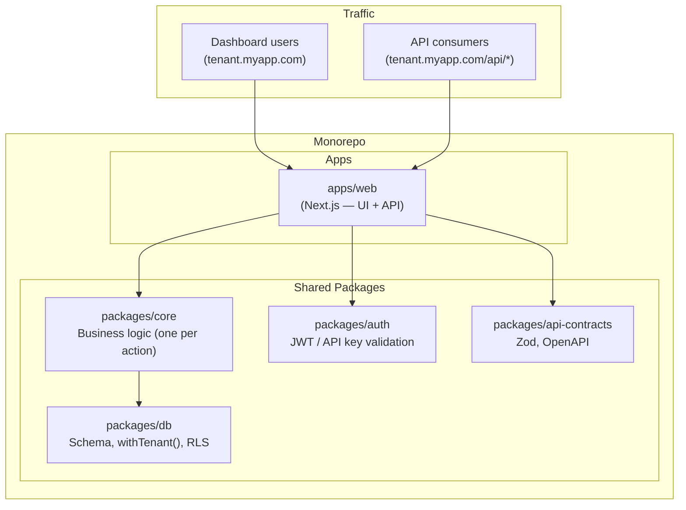
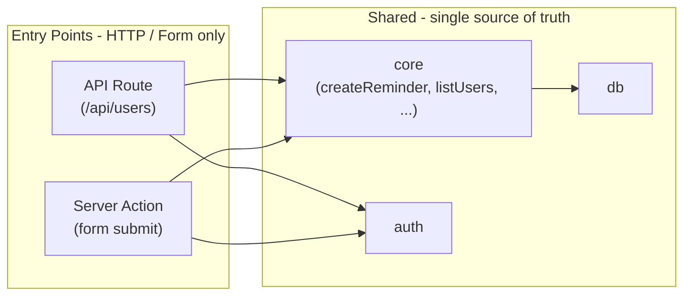

# API Architecture: Monorepo & Coupled Next.js API

> **Preview note:** This file lives in `docs/`. If the diagram below shows as raw code instead of a flowchart, use a viewer with Mermaid support (e.g. the "Markdown Preview Mermaid Support" extension in VS Code/Cursor).

This plan describes the API architecture: **Next.js** with a **shared single source of truth** (packages/core, db, auth) in a **monorepo**. The Next.js app (apps/web) is the single HTTP surface for both the UI and the API. It complements [Multi-Tenancy RLS Plan](./multi-tenancy-plan.md).

---

## Approach: Coupled Next.js API with Shared Packages

- **apps/web** (Next.js) handles both the UI and the API. API routes live at `apps/web/src/app/api/**/route.ts`; Server Actions handle form mutations.
- **Shared packages** (packages/db, packages/core, packages/auth, packages/api-contracts) hold all business logic, database access, auth, and HTTP contracts. Next.js API routes and Server Actions are thin adapters that resolve tenant, parse input, call core, and return responses.
- **No separate API service.** There is no `apps/api`. If a separate public API surface is needed in the future, the shared packages make that addition straightforward without reimplementing logic.

**Why this approach:** Keeps the stack simple — one app, one deployment, one domain. All business logic lives in shared packages, so adding a second HTTP surface later (if ever needed) is "add an app that imports core," not a rewrite.

---

## Tradeoffs of this approach (and mitigations)

| Risk                                                                                                                                            | Mitigation                                                                                                                                                    |
| ----------------------------------------------------------------------------------------------------------------------------------------------- | ------------------------------------------------------------------------------------------------------------------------------------------------------------- |
| **Next/React leaking into core** — If core depends on `headers()`, request/response types, or React, it's no longer reusable.                   | Keep core **pure**: `(tenantId, input) => output`. No request/response, no Next/React imports.                                                                |
| **Logic in handlers instead of core** — With only Next.js, it's tempting to put logic in Server Actions or route handlers.                      | **Discipline**: treat "all actions go through the shared layer" as the rule from the start.                                                                   |
| **Core tied to first API shape** — The API you design is for the dashboard. A future public API might need different versioning or field names. | Design core with **typed inputs/outputs**; let each consumer do its own HTTP/versioning on top of the same core.                                              |
| **Scaling API and UI together** — API and UI traffic scale as one deployment.                                                                   | For most applications this is fine. If API traffic diverges significantly from UI traffic in the future, the shared packages make extraction straightforward. |
| **Execution limits (serverless)** — Serverless platforms may impose execution time limits on API routes.                                        | Choose a deployment target that fits the workload (e.g. long-running Node.js process on Railway, or Vercel with appropriate plan limits).                     |

---

## Monorepo: pros and cons

The plan uses a **monorepo** (apps/web + packages/\*).

**Pros:**

- **Single place for shared logic** — Core, db, auth live in packages. No copying code or publishing internal npm packages.
- **Refactors and types** — Change a core function once; TypeScript sees usages across the app. One version of the truth.
- **Future flexibility** — If a second app is ever needed, it's a new app in the same repo importing the same packages. No extraction, no new repo.
- **Unified tooling** — One ESLint/Prettier/TS config; CI can run tests and builds for all apps and packages (e.g. with Turborepo caching).

**Cons / tradeoffs:**

- **More setup** — Workspace config, build order, possibly a task runner. New contributors need "run from root" or "run app X."
- **Build and deploy** — Define what to build and when (e.g. deploy web when apps/web or packages/core changes). Most platforms support this; it's one more thing to configure.
- **Repo-wide permissions** — You can't grant "only API" access; it's one repo. Usually fine for a single team.
- **Can feel heavy early** — One app and a few packages may feel like overkill. Payoff is when shared logic prevents duplication.

---

## How Next.js uses packages/core

Next.js (apps/web) is a **thin HTTP adapter**; core holds the single source of truth for each action.

**Flow:**

1. **Request** hits Next.js (API route or Server Action).
2. **Next.js** parses the request, gets the user/session, and resolves **tenantId** (e.g. from middleware or auth).
3. **Next.js** calls a function from **packages/core** with `(tenantId, input)`.
4. **Core** runs the use case (inside `withTenant()` and packages/db) and returns a typed result.
5. **Next.js** turns that result into an HTTP response (JSON, redirect, etc.).

**Two entry points:**

| Entry point                                       | Role                                                                                                                                                                                        |
| ------------------------------------------------- | ------------------------------------------------------------------------------------------------------------------------------------------------------------------------------------------- |
| **API route** (e.g. `app/api/reminders/route.ts`) | Read body/query, validate (e.g. Zod), get tenant from middleware/session, call `createReminder(tenantId, input)` or `listReminders(tenantId, filters)`, return `NextResponse.json(result)`. |
| **Server Action** (e.g. form submit)              | Get form data and session, resolve tenant, call the same core functions, return data for the client (e.g. revalidatePath).                                                                  |

**Dependency direction:**

- **apps/web** depends on **packages/core** (e.g. `"@repo/core": "workspace:*"`). Next.js code imports core and calls it.
- **packages/core** does **not** import Next.js or apps/web. It only imports from packages/db (and shared types). That keeps core framework-agnostic and reusable.

---

## Architecture Overview



- **apps/web**: Next.js application. Serves the UI (SSR, RSC, static pages) and the API (`/api/*` routes). Tenant from subdomain/custom domain via middleware; session auth (NextAuth/Clerk) for UI users, API key/JWT for programmatic access. Uses `packages/db`, `packages/core`, `packages/auth`, and `packages/api-contracts`.

---

## One action, one implementation

You do **not** maintain separate API logic for different entry points. The actual behavior lives in a **shared layer** that all entry points call.

| Layer              | Responsibility                                                                                        | Where it lives                          |
| ------------------ | ----------------------------------------------------------------------------------------------------- | --------------------------------------- |
| **HTTP**           | Parse request, validate input (body/query), set tenant from auth, call shared logic, return response. | Next.js route handler or Server Action. |
| **Business logic** | Rules, validation, and DB access for "create reminder", "list users", etc.                            | **Shared package** (`packages/core`).   |

**Flow:**

1. **API route**: Client sends `POST /api/users` → route handler gets tenant from session/middleware → validates body with Zod from `@repo/api-contracts` → calls `createUser(tenantId, data)` from `@repo/core` → returns result.
2. **Server Action**: User submits form → action gets tenant from session → calls the **same** `createUser(tenantId, data)` → returns result (e.g. revalidatePath).

So you maintain **one** implementation of "create user" (and every other action) in the shared package. API routes and Server Actions only handle HTTP/form concerns, then delegate.



---

## Phase 1: Monorepo Layout

### 1.1 Directory structure

```
packages/
  db/                 # Schema, migrations, withTenant(), regional pools
  core/               # Business logic: createReminder, listUsers, etc.
  auth/               # Shared auth: JWT validation, API key → tenant
  api-contracts/      # Zod schemas, OpenAPI generation
apps/
  web/                # Next.js (dashboard, Server Actions, API routes)
```

- **packages/core**: Use-case / application logic. Receives `tenantId` and typed input; uses `packages/db` inside `withTenant()`; returns typed result. No HTTP, no framework types. All API routes and Server Actions call into `core` so each action is implemented once.

### 1.2 Tooling

- **Workspace**: Use npm/pnpm/yarn workspaces or Turborepo. Root `package.json` defines `workspaces: ["apps/*", "packages/*"]`.
- **Build**: Each app and package has its own build. `apps/web` depends on `packages/db`, `packages/core`, `packages/auth`, and `packages/api-contracts`.
- **Deploy**: Deploy `apps/web` to the chosen platform (e.g. Railway, Vercel, Fly.io).

### 1.3 Relationship to existing code

If the current repo is a single Next.js app with `src/db`, `src/middleware`, etc., Phase 1 can mean:

- **Option A**: Create `apps/web` and move the current app there; create `packages/db` and `packages/core` from the start.
- **Option B**: Keep current structure temporarily; add the monorepo layout and migrate incrementally (e.g. extract db, then core, then move app to apps/web).

**Chosen: Option A.** Phase 1 implemented: monorepo scaffold with pnpm workspaces (`pnpm-workspace.yaml`), `apps/web` (Next.js app moved here), `packages/db`, `packages/core`, and `packages/auth` (stubs). Root scripts delegate to `pnpm --filter web`.

---

## Phase 2: Shared DB Package

### 2.1 Responsibility

- **packages/db** exposes: schema (Drizzle), migrations, `withTenant(tenantId, callback)`, and (if applicable) regional connection helpers from [multi-tenancy-plan.md](./multi-tenancy-plan.md).
- The web app sets tenant context per request and calls `withTenant()` before any tenant-scoped query; RLS enforces isolation.

### 2.2 Contract

- **Input**: Caller provides `tenantId` (from Next.js middleware or from auth).
- **Output**: Same DB interface; no framework-specific code inside `packages/db`.

### 2.3 Files (reference)

| Action          | Path                                                           |
| --------------- | -------------------------------------------------------------- |
| Create / move   | `packages/db/package.json`, `tsconfig.json`                    |
| Move / refactor | `packages/db/schema.ts`, `index.ts`, `tenant.ts`, `regions.ts` |
| Move            | `packages/db/drizzle/` (migrations)                            |

**Implemented:** Schema, client (pool + drizzle), `withTenant`, and migrations live in `packages/db`. `apps/web` depends on `@repo/db`; all routes and auth use it. Drizzle config in web points at `packages/db` for schema and out. Seed and apply-rls run from web and use `@repo/db`.

---

## Phase 2b: Shared Core (business logic)

### 2b.1 Responsibility

- **packages/core** exposes **use-case functions** such as `createReminder(tenantId, input)`, `listReminders(tenantId, filters)`, `getUser(tenantId, userId)`, etc.
- Each function: takes `tenantId` + typed input, runs inside `withTenant(tenantId, () => { ... })` using `packages/db`, applies business rules, returns typed result (or throws).
- **No HTTP**: No request/response types, no framework imports. Pure TS functions.

### 2b.2 Contract

- **Input**: `tenantId` (uuid) + a typed payload (e.g. from Zod or TS interface). Caller is responsible for parsing HTTP (body/query) and resolving tenant; core only receives already-resolved values.
- **Output**: Typed result (e.g. `{ id, ... }` or array). Errors via thrown exceptions or Result types, as you prefer.

### 2b.3 Files (reference)

| Action | Path                                                                                                      |
| ------ | --------------------------------------------------------------------------------------------------------- |
| Create | `packages/core/package.json`, `tsconfig.json`                                                             |
| Create | `packages/core/reminders.ts` — createReminder, listReminders, getReminder, updateReminder, deleteReminder |
| Create | `packages/core/users.ts` — getUser, listUsers (as needed)                                                 |
| Create | `packages/core/index.ts` — re-export                                                                      |

**Implemented:** `packages/core` has `reminders.ts` (listReminders, createReminder, getReminder, updateReminder, deleteReminder) and `users.ts` (listUsers, getUser, createUser, updateUser, deleteUser, authenticate). Types and CoreNotFoundError/CoreConflictError in core; web routes and server actions call core and map errors to HTTP. No HTTP/framework in core.

---

## Phase 3: Shared Auth Package

### 3.1 Responsibility

- **packages/auth** provides:
  - Validation of **JWT** (e.g. issued by NextAuth/Clerk): verify signature, extract `tenant_id` (and optionally `user_id`).
  - Validation of **API keys**: lookup key → tenant (and optionally scopes) via DB or cache; return tenant context.
- Used by **apps/web** for both session/JWT auth (UI users) and API key auth (programmatic access).

### 3.2 Contract

- **Input**: Raw request (headers, or parsed `Authorization`).
- **Output**: `{ tenantId, userId?, scopes? }` or error. Caller then uses this to call `withTenant()` and enforce permissions.

### 3.3 Files (reference)

| Action | Path                                                           |
| ------ | -------------------------------------------------------------- |
| Create | `packages/auth/package.json`, `tsconfig.json`                  |
| Create | `packages/auth/jwt.ts` — JWT verify + claim extraction         |
| Create | `packages/auth/api-key.ts` — API key lookup, tenant resolution |
| Create | `packages/auth/index.ts` — re-export                           |

**Implemented:** `packages/auth` has `jwt.ts` (verifyJwt, AuthContext, JwtSessionPayload) and `api-key.ts` (validateApiKey stub). Web uses verifyJwt for session verification; createSession/verifySession and cookie handling remain in web. API-key lookup is stubbed for when programmatic API access is added.

---

## Phase 4: API Contracts Package

### 4.1 Responsibility

- **packages/api-contracts** holds:
  - **Zod schemas** for request/response bodies and query params.
  - **OpenAPI** spec generated from the Zod schemas (e.g. via `@asteasolutions/zod-to-openapi`).
- **apps/web** API routes import these schemas to validate input and type responses. The generated `openapi.json` serves as documentation and an instruction set for AI-assisted implementation.

### 4.2 Contract

- **Input**: Shared Zod schemas.
- **Output**: OpenAPI spec (generated at build time, committed or served) and runtime validation in API route handlers.

### 4.3 Files (reference)

| Action | Path                                                                          |
| ------ | ----------------------------------------------------------------------------- |
| Create | `packages/api-contracts/package.json`, `tsconfig.json`                        |
| Create | `packages/api-contracts/schemas/` — per-resource Zod schemas                  |
| Create | `packages/api-contracts/index.ts` — re-export schemas                         |
| Create | `packages/api-contracts/scripts/generate-openapi.ts` — generates openapi.json |

---

## Phase 5: Public API Exposure (if needed)

Decisions to make if/when the API is exposed to external consumers. All through Next.js API routes.

### 5.1 Authentication for programmatic access

| Option       | Description                                                                        |
| ------------ | ---------------------------------------------------------------------------------- |
| **API keys** | Each tenant (or app) has API keys; key → tenant lookup in `packages/auth`.         |
| **JWT**      | For dashboard-originated calls; same JWT as session, validated by `packages/auth`. |
| **Both**     | API keys for external integrators; JWT for same-tenant dashboard calls.            |

**Decision**: _TBD_

### 5.2 Rate limiting and quotas

- **Scope**: Per API key, per tenant, or both.
- **Implementation**: In Next.js middleware or route-level middleware (e.g. Upstash rate limiter or in-memory store).
- **Decision**: _TBD_

### 5.3 API versioning

- If needed, path-based versioning (e.g. `/api/v1/users`) or header-based versioning.
- **Decision**: _TBD_

---

## How This Fits the Multi-Tenancy Plan

- **Tenant resolution**: Next.js middleware resolves tenant from hostname (subdomain/custom domain); see [multi-tenancy-plan.md](./multi-tenancy-plan.md). Session/JWT includes `tenant_id`; middleware and auth verify consistency. For programmatic API access, tenant comes from the API key via `packages/auth`.
- **Database**: Single Neon PostgreSQL; same schema, same RLS policies. `packages/db` is the single place for `withTenant()` and regional routing (if used).
- **Auth**: NextAuth/Clerk for UI users; `packages/auth` for API key validation. JWT claims (e.g. `tenant_id`) are the source of truth for tenant context.

---

## Implementation Order

1. **Phase 1** — Monorepo scaffold: apps/web, packages/db, packages/core. Workspace and build config. _(completed)_
2. **Phase 2** — Shared DB package so the app can use the same schema and `withTenant()`. _(completed)_
3. **Phase 2b** — Shared core package with use-case functions. All Next.js API routes and Server Actions call core; no business logic in handlers. _(completed)_
4. **Phase 3** — Shared auth package (JWT for sessions; API-key support for programmatic access). _(completed)_
5. **Phase 4** — Add packages/api-contracts (Zod, OpenAPI); wire Next.js API routes to contracts.
6. **Phase 5** — If needed: decide auth strategy, rate limiting, and versioning for public/programmatic API access; document and implement.

Phases 1–3 (including 2b) give you a working Next.js app with a single source of truth in core. Phases 4–5 add contract-driven development and optional public API exposure.
