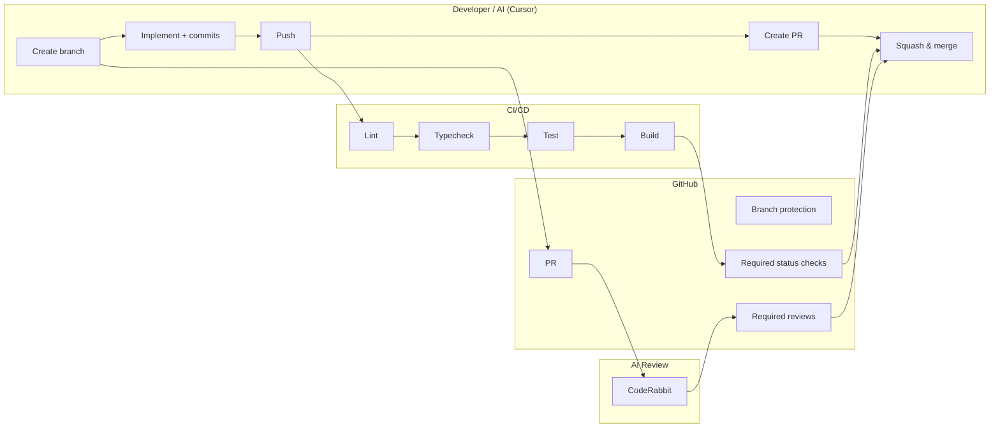

# Code Repo, PR Process & AI Integration Research

Recommendations for where to host the codebase, an efficient AI-integrated PR process, quality gates, and CI/CD integration.

---

## Summary

This document covers: (1) where to host the repo (GitHub, Bitbucket, or GitLab), (2) an AI-aware PR process from branch creation through merge, (3) quality gates and CI/CD integration, and (4) a workflow illustration.

**End-to-end flow:**

- **Repo:** Prefer **GitHub** for best AI tooling and Actions; use Bitbucket only if committed to Atlassian; GitLab if you want one platform and optional self-host.
- **Process:** Feature branches → conventional commits (AI-assisted) → push → CI runs (lint, typecheck, test, build) → create PR (AI/bot) → **CodeRabbit** auto-review + human approval → merge when all quality gates pass.
- **Quality gates:** Lint, format, typecheck, test, build (and optionally security) in CI; branch protection requires these status checks + at least one human approval.
- **CI/CD:** One pipeline (Actions / Pipelines / GitLab CI) that runs the same checks; optional deploy on merge to `main`.
- **AI code review:** **CodeRabbit** as the primary AI reviewer (installed as a GitHub App); auto-reviews every PR with multi-layered analysis (AI + 40+ linters), severity-ranked feedback, and one-click fixes. Human approval remains mandatory.

**PR process in short:**

1. **Branch** — `main` / `develop`; feature branches `feature/<ticket>-short-name`; AI can suggest branch names from tickets.
2. **Commits** — Conventional commits; pre-commit lint/format; same checks in CI.
3. **Push & PR** — Push triggers CI; AI/bot creates PR with title, description, ticket link, reviewers.
4. **Review** — CodeRabbit auto-reviews (summary, inline comments, one-click fixes); CI must be green; at least one human approval.
5. **Merge** — After CodeRabbit has posted its review (feedback should be addressed, though not enforced by automation), CI green, and human approvals met; prefer squash or rebase merge.
6. **Gates** — Branch protection: required status checks, required reviews, no force-push on `main`/`develop`.

**Real-world example** — adding `DELETE /api/reminders/:id` (soft-delete):

1. **Branch**

   ```bash
   git checkout main && git pull
   git checkout -b feature/PROJ-42-soft-delete-reminder
   ```

2. **Commits** (sparkle icon generates message → commitlint validates → lint-staged formats)

   ```bash
   # Stage packages/api-contracts/src/schemas/reminders.ts → click ✨ → generates:
   git commit -m "feat(api-contracts): add delete reminder response schema"

   # Stage packages/core/src/reminders.ts → click ✨ → generates:
   git commit -m "feat(core): implement soft-delete for reminders"

   # Stage apps/web/src/app/api/reminders/[id]/route.ts → click ✨ → generates:
   git commit -m "feat(api): add DELETE /api/reminders/:id endpoint"
   ```

3. **Push & PR** (Cursor Agent generates title + body from diff; CodeRabbit adds walkthrough after)

   ```bash
   git push -u origin feature/PROJ-42-soft-delete-reminder

   # Ask Cursor Agent: "create a PR for this branch" — or manually:
   gh pr create \
     --title "feat: soft-delete reminders via DELETE /api/reminders/:id" \
     --body "Adds DeleteReminderResponseSchema, soft-delete core logic, and DELETE handler. Closes PROJ-42"
   ```

4. **Review** — CodeRabbit posts within minutes: PR walkthrough summary, inline comments (e.g. "missing `pnpm generate:openapi`"), severity-ranked issues. CI runs lint → typecheck → test → build. Human reviewer reads CodeRabbit summary, checks domain logic, approves.

5. **Merge** — CI green + CodeRabbit reviewed + 1 human approval met:

   ```bash
   gh pr merge --squash
   ```

   Result on `main`: `feat: soft-delete reminders via DELETE /api/reminders/:id (#18)`

6. **Gates** (pre-configured on `main`): required status checks (`Lint`, `Typecheck`, `Test`, `Build`), 1+ human approval, no force-push, no merge with failing checks.

**Workflow illustration:**

```
┌─────────────────────────────────────────────────────────────────────────────────┐
│                        AI-INTEGRATED PR & QUALITY GATE FLOW                       │
└─────────────────────────────────────────────────────────────────────────────────┘

  Developer / Cursor (AI)                Repo (e.g. GitHub)              CI/CD
  ───────────────────────                ──────────────────              ─────

       │
       │  1. Create branch from main
       │     (AI suggests name: feature/TICKET-123-add-reminders-api)
       ├──────────────────────────────────────────────────────────────────────────►
       │                                                                  │
       │  2. Implement + AI-assisted commits                              │
       │     (Conventional commits; pre-commit: lint, format)             │
       │                                                                  │
       │  3. Push branch                                                 │
       ├──────────────────────────────────►  Branch pushed                │
       │                                    │                             │
       │                                    │  4. Trigger CI workflow     │
       │                                    ├─────────────────────────────►
       │                                    │                             │  Lint
       │                                    │                             │  Typecheck
       │                                    │                             │  Test
       │                                    │                             │  Build
       │                                    │  5. Status checks (quality   │
       │                                    │     gates) report back      │
       │                                    │◄─────────────────────────────
       │                                    │                             │
       │  6. Create PR (AI or bot: title,   │                             │
       │     description, link ticket)      │                             │
       ├──────────────────────────────────►  PR created                    │
       │                                    │                             │
       │                                    │  7. CodeRabbit auto-review   │
       │                                    │     (summary + inline)       │
       │                                    │  8. Human reviewer approves │
       │                                    │  9. All checks green        │
       │                                    │                             │
       │  10. Squash & merge (when gates pass)                            │
       ├──────────────────────────────────►  Merge to main                │
       │                                    │                             │
       │                                    │  11. Post-merge CI          │
       │                                    │      (e.g. deploy to staging)│
       │                                    ├─────────────────────────────►
       │                                    │                             │
       ▼                                    ▼                             ▼
```

**Mermaid diagram:**



---

## Comparison

### Repo host (GitHub vs Bitbucket vs GitLab)

| Option        | Best for                               | AI / automation                              | CI/CD                                       | Verdict for this project        |
| ------------- | -------------------------------------- | -------------------------------------------- | ------------------------------------------- | ------------------------------- |
| **GitHub**    | Open source, startups, most devs       | Copilot, Cursor, many bots, Actions          | GitHub Actions (free tier, large ecosystem) | **Recommended**                 |
| **Bitbucket** | Jira-heavy, strict Atlassian shops     | Limited native AI; Cursor/Copilot still work | Bitbucket Pipelines (minutes limits)        | Good if all-in Atlassian        |
| **GitLab**    | Self-host, compliance, single platform | GitLab Duo (AI), Code Suggestions            | Built-in CI/CD, no minute caps on self-host | Strong if you want one platform |

### CI/CD by platform

| Platform      | Config                    | Branch protection                                       | Notes                                                  |
| ------------- | ------------------------- | ------------------------------------------------------- | ------------------------------------------------------ |
| **GitHub**    | `.github/workflows/*.yml` | Required status checks, required reviews, no force-push | One workflow for push + PR; optional deploy on `main`. |
| **Bitbucket** | `bitbucket-pipelines.yml` | Required builds, required approvals                     | Same stages; watch pipeline minute limits.             |
| **GitLab**    | `.gitlab-ci.yml`          | Pipelines must succeed, MR approvals                    | Stages: lint, test, build; approvals in MR settings.   |

### Quality gates (what to enforce)

| Gate             | Where             | What                                                                                                         |
| ---------------- | ----------------- | ------------------------------------------------------------------------------------------------------------ |
| **Lint**         | Pre-commit + CI   | ESLint (and/or Biome); fail on error.                                                                        |
| **Format**       | Pre-commit + CI   | Prettier (or formatter); check only.                                                                         |
| **Types**        | CI                | `pnpm -r exec tsc --noEmit` (or per-package) in monorepo.                                                    |
| **Unit tests**   | CI                | `pnpm test`; require green.                                                                                  |
| **Build**        | CI                | `pnpm build` (or build only affected packages).                                                              |
| **Security**     | CI                | `pnpm audit` or similar; optional "0 high/critical" for merge.                                               |
| **AI PR review** | CodeRabbit (auto) | CodeRabbit posts summary, inline comments, and one-click fixes on every PR; human still required to approve. |
| **Human review** | Branch protection | At least 1 (or 2) approvals; no self-merge for `main`.                                                       |

Suggested order in CI: **lint → typecheck → test → build** (fail fast).

### AI integration points

| Step          | How AI helps                    | Tool / approach                                                                          |
| ------------- | ------------------------------- | ---------------------------------------------------------------------------------------- |
| Branch name   | Suggests from ticket/task       | Cursor / script reading ticket title.                                                    |
| Commits       | Conventional message + scope    | Cursor sparkle icon (✨) in Source Control panel; commitlint rejects bad format.         |
| PR title/body | Title + body from diff/commits  | Cursor Agent generates via `gh pr create`; CodeRabbit adds walkthrough comment.          |
| Code review   | First-pass review, risks, style | **CodeRabbit** auto-review: summary, inline comments, severity ranking, one-click fixes. |
| Human review  | Focus on what AI missed         | Human reviews CodeRabbit summary + diff; approves or requests changes.                   |

### AI-assisted commits and PR creation

**Commit messages — Cursor sparkle icon:**

1. Stage files in the Source Control panel (`Ctrl+Shift+G`).
2. Click the **sparkle icon (✨)** next to the commit message input (or bind to a shortcut via Keyboard Shortcuts → "Generate Commit Message").
3. Cursor reads the staged diff and generates a message. Add a `.cursor/rules/commits.mdc` rule (always-apply) so Cursor uses Conventional Commits format: `type(scope): description`. See [code-repo-pr-process-plan.md](./code-repo-pr-process-plan.md) (step 3 under "Commit format") for the full `.cursor/rules/commits.mdc` frontmatter and body.
4. Commitlint (`@commitlint/config-conventional`) validates the message via the husky `commit-msg` hook. If the format is wrong, the commit is rejected and you fix the message. The Cursor rule guides AI generation; commitlint enforces the format.

Flow: `Stage → Sparkle icon generates message → Commit → Commitlint validates → Lint-staged runs prettier → Done`

**PR title and body — Cursor Agent + CodeRabbit:**

Two layers handle PR documentation automatically:

| Layer            | What it generates                                                                        | When                                                                                                                 |
| ---------------- | ---------------------------------------------------------------------------------------- | -------------------------------------------------------------------------------------------------------------------- |
| **Cursor Agent** | PR title + body (from diff and commits)                                                  | At PR creation time — ask the agent "create a PR for this branch" or use `gh pr create` with AI-generated arguments. |
| **CodeRabbit**   | Detailed walkthrough comment: file-by-file summary, change categories, sequence diagrams | Automatically within minutes after the PR is opened.                                                                 |

The Cursor Agent generates the initial PR title and description. CodeRabbit then adds a comprehensive review comment that serves as the detailed summary. Between the two, the PR is fully documented without manual writing.

**Alternative: `gh` CLI one-liner** (if not using Cursor Agent):

```bash
gh pr create \
  --title "$(git log main..HEAD --format='%s' | head -1)" \
  --body "$(git log main..HEAD --format='- %s')"
```

Uses the first commit as the title and all commits as a bullet list for the body.

---

## Code review: Rovo vs CodeRabbit and alternatives

This section compares AI-powered PR/code review tools so you can choose one (or combine with GitHub Copilot) for the “AI first-pass review” step in the workflow. The main contenders are **Rovo** (Atlassian) and **CodeRabbit**, with several alternatives worth considering depending on repo host, budget, and compliance needs.

### At a glance

| Tool                      | Repo support                     | Strengths                                                                 | Limitations                                       | Pricing / model                  |
| ------------------------- | -------------------------------- | ------------------------------------------------------------------------- | ------------------------------------------------- | -------------------------------- |
| **Rovo Dev**              | Bitbucket, GitHub                | Jira/AC validation, enterprise, no fine-tuning, IDE (Serve mode)          | Atlassian ecosystem; best fit with Jira           | Atlassian / Rovo subscription    |
| **CodeRabbit**            | GitHub (primary), GitLab         | Deep PR analysis, 40+ linters, one-click fixes, CLI + IDE                 | GitHub-first; can be noisy without tuning         | Paid tiers; free for open source |
| **GitHub Copilot**        | GitHub only                      | Native PR summaries, ready-to-commit suggestions, GPT-4o                  | Lighter than dedicated review tools; no Bitbucket | GitHub subscription              |
| **Greptile**              | GitHub, GitLab                   | Full codebase/AST context, custom rules (plain English), Mermaid diagrams | Newer; less track record than CodeRabbit          | ~$30/developer/mo; OSS free      |
| **Sourcery**              | GitHub                           | Learns from feedback to reduce noise, 30+ languages, visual diagrams      | Less emphasis on security/deep bugs               | From ~$12/developer/mo           |
| **Presubmit**             | GitHub (Actions)                 | Open source, bring-your-own LLM, runs in your env (privacy)               | Self-managed; you supply API key and config       | Free (you pay for LLM API)       |
| **Qodo Merge** (CodiumAI) | GitHub, GitLab, Bitbucket, Gitea | Self-host, OSS, test gen + logic bugs                                     | More setup; focus on tests/logic vs style         | Open source / self-host          |
| **Gemini Code Assist**    | GitHub                           | Free PR summaries and suggestions, configurable review style              | Google ecosystem; less proven than CodeRabbit     | Free (GitHub Marketplace)        |

### Rovo Dev (Atlassian)

- **What it is:** Enterprise AI code review from Atlassian; works in **Bitbucket and GitHub**.
- **Features:** Context-aware reviews using project and business context; validates PRs against **Jira acceptance criteria** and business objectives. Inline suggestions for correctness, logic, security, and maintainability; customizable coding standards and domain rules (e.g. structured logging, PII, feature flags, API security). Built-in security/compliance checks. **Rovo Dev Serve mode** brings review capabilities into the IDE (2025).
- **Research (Atlassian):** In large-scale evaluation, Rovo Dev comments led to **code resolution in ~38.7%** of cases; **~30.8% shorter PR cycle** and **~35.6% fewer human comments**. It flagged **2.8× more bugs** and **1.4× more maintainability issues** than human reviewers in studies. No fine-tuning required (addresses privacy concerns).
- **Best for:** Teams already on **Jira + Bitbucket or GitHub** who want AC-backed reviews, enterprise support, and optional IDE integration without fine-tuning.

### CodeRabbit

- **What it is:** AI code review platform focused on **GitHub** (and GitLab); widely adopted (e.g. 2M+ repos, 75M+ defects found in marketing claims).
- **Features:** Automatic review shortly after PR creation. **Multi-layered:** AI plus 40+ open-source linters and security scanners. Surfaces runtime errors, null pointers, race conditions, logic flaws, and security issues. Feedback is categorized (nitpicks, refactors, potential issues) with severity (Info → Critical). **One-click fixes**, AI-generated summaries and walkthroughs, and architectural diagrams. **CLI** for uncommitted changes; **IDE integration**; **YAML config** for custom rules and workflows. SOC 2 Type II; end-to-end encryption.
- **Best for:** **GitHub-first** teams that want deep, automated PR analysis, one-click fixes, and a single tool for style, maintainability, and security. Can be noisy until guidelines are tuned.

### GitHub Copilot (PR review)

- **What it is:** GitHub-native AI; PR features include **summaries** and **ready-to-commit suggestions** in the PR UI (e.g. “Summary” in description or comments). Powered by **GPT-4o** (per GitHub); Copilot coding agent can be invoked with `@copilot` for explicit review actions.
- **Features:** PR summary generation; Chat on GitHub.com for questions about PRs, issues, commits, and files. Usage metrics APIs for PR outcomes, suggestion acceptance, and cycle time. Lightweight compared to dedicated review bots—no 40+ linters or custom rule engine out of the box.
- **Best for:** Teams that already use **GitHub + Copilot** and want a simple, integrated first-pass summary and suggestions without adding another vendor. Use alongside a dedicated tool (e.g. CodeRabbit) if you need deeper, rule-driven review.

### Other options (short)

- **Greptile:** Full codebase/AST context; custom rules in plain English; PR summaries with Mermaid; GitHub + GitLab. Claims 4× faster merges, 3× more bugs caught. ~$30/developer/month; free for open source. Good if you want strong codebase context and custom rules without writing YAML.
- **Sourcery:** Lower-cost (~$12/dev/mo); learns from feedback to reduce noise; 30+ languages; visual diagrams. Less focused on deep security/bug hunting than CodeRabbit.
- **Presubmit:** Open-source; runs in **GitHub Actions** with bring-your-own LLM API key; code stays in your environment. Good for privacy-focused or cost-conscious teams willing to maintain config.
- **Qodo Merge (CodiumAI):** Open-source/self-hosted; supports GitHub, GitLab, Bitbucket, Gitea. Strong on test generation and logic bugs; less “comment on every style issue” than CodeRabbit.
- **Gemini Code Assist:** Free in GitHub Marketplace; PR summaries and suggestions; configurable review style. Good as a free supplement; less ecosystem data than CodeRabbit/Rovo.

### Choosing for this project

- **GitHub + want best-in-class PR review:** **CodeRabbit** for depth, one-click fixes, and custom rules; add **Copilot** for summaries and inline suggestions if you already have it.
- **Bitbucket or strong Jira integration:** **Rovo Dev** for native Jira AC validation and Bitbucket/GitHub support.
- **GitLab-only or multi-host (incl. Gitea):** **Greptile** (GitHub + GitLab) or **Qodo Merge** (GitHub, GitLab, Bitbucket, Gitea).
- **Minimal cost / privacy / self-host:** **Presubmit** (BYO LLM, Actions) or **Qodo Merge** (self-host, OSS).
- **Free and simple:** **GitHub Copilot** PR summary + suggestions, or **Gemini Code Assist**.

Use the **AI integration points** table earlier in this doc to plug your chosen tool into the “Code review” row (e.g. “CodeRabbit” or “Rovo Dev” instead of “GitHub Copilot PR review”) and keep **human review mandatory** regardless of which bot you use.

---

## Benefits and potential issues

### Benefits

- **Faster, consistent PRs:** AI-assisted branch names, conventional commits, and PR descriptions reduce manual work and keep history consistent.
- **Earlier feedback:** Pre-commit hooks and CI catch lint, type, and test failures before human review.
- **Clear quality bar:** Quality gates and branch protection prevent merging with failing checks or without approval.
- **Human focus:** CodeRabbit does first-pass review with severity-ranked feedback; humans concentrate on design, domain logic, and edge cases.
- **Single pipeline:** One CI config (e.g. GitHub Actions) for the pnpm monorepo, with optional filtering by changed packages.
- **Strong automation:** GitHub’s APIs and Actions (or equivalent) support branch protection, status checks, and optional deploy on merge.

### Potential issues

- **AI mistakes:** CodeRabbit (or any AI reviewer) can suggest incorrect fixes or flag false positives; **mandatory human review** mitigates this. Tune `.coderabbit.yaml` to reduce noise over time.
- **Over-reliance on AI:** Teams may skip reading diffs; keep “at least one human approval” and encourage reviewers to use AI as support, not replacement.
- **Bitbucket limits:** Pipeline minutes and stricter caps can make CI/CD more constrained than on GitHub/GitLab.
- **Setup and maintenance:** Branch protection, status checks, and CodeRabbit require one-time setup and occasional tuning (`.coderabbit.yaml` for noise reduction).
- **CI as bottleneck:** Long-running jobs can slow PR throughput; use caching, parallel jobs, and (where possible) only run checks for changed packages.

---

## Recommendation rationale

### Why GitHub

- **AI ecosystem:** Best support for Cursor, Copilot, and third-party PR/code-review bots.
- **CI/CD:** GitHub Actions fits a pnpm monorepo, integrates with branch protection and status checks, and avoids the kind of minute limits Bitbucket imposes on private repos.
- **Automation:** Strong APIs for branch protection, PR creation, and status checks, which support the desired PR and quality-gate flow.
- **Familiarity:** Most developers and tooling assume GitHub; onboarding and integrations are straightforward.

### When to choose Bitbucket or GitLab

- **Bitbucket:** Choose if the organization is standardizing on Jira/Confluence and wants PRs and issues in one place; accept Pipeline minute limits and less native AI.
- **GitLab:** Choose if you want a single product for repo, CI, and security, and value self-hosting or no CI minute caps on self-hosted.

### Why this PR process

- **Feature branches + conventional commits:** Keeps `main` stable, makes history readable, and allows AI to generate consistent messages and PR descriptions.
- **CodeRabbit first, human second:** CodeRabbit handles repetitive review (style, bugs, security) with severity-ranked feedback and one-click fixes; humans make the final call and focus on design and domain logic.
- **Quality gates before merge:** Lint, typecheck, test, and build must pass so broken code is not merged; branch protection enforces this.
- **Human review mandatory:** Every PR to `main` requires at least one human approval so AI does not replace accountability.

### PR and code review recommendation

- **Default (GitHub):** Use **CodeRabbit** as the primary AI reviewer. It fits the “AI first, human second” flow: automatic review on every PR, multi-layered analysis (AI + 40+ linters), severity-ranked feedback (nitpicks, refactors, potential issues), and one-click fixes so reviewers spend less time on style and more on design and domain logic. Add **GitHub Copilot** for PR summaries and inline suggestions if the team already has it; Copilot alone is lighter than CodeRabbit but sufficient for teams that want minimal tooling. Tune CodeRabbit with YAML guidelines and team feedback to reduce noise over time.
- **Bitbucket or strong Jira use:** Use **Rovo Dev**. It integrates with Jira acceptance criteria and runs on both Bitbucket and GitHub, so PRs can be validated against AC and business context without fine-tuning. Fits the same “AI first-pass, human approval required” model; use Rovo’s custom rules for coding standards and domain-specific checks.
- **GitLab or multi-host:** Prefer **Greptile** (GitHub + GitLab) for codebase-aware review and plain-English custom rules, or **Qodo Merge** (GitHub, GitLab, Bitbucket, Gitea) if you need self-host / open source and are okay with more setup.
- **Regardless of tool:** Keep **human review mandatory** (branch protection: at least one approval). The AI reviewer is the first pass; a human must approve before merge. This preserves accountability and ensures design, security, and domain decisions get human judgment. See the **Code review: Rovo vs CodeRabbit and alternatives** section for the full comparison and “Choosing for this project” guidance.

### Why these quality gates and order

- **Lint and format:** Enforce style and common bugs locally and in CI.
- **Typecheck:** Catches type errors before tests run.
- **Tests:** Validate behavior; required to be green.
- **Build:** Ensures the monorepo (or affected packages) build successfully.
- **Order (lint → typecheck → test → build):** Fail fast so cheaper steps run first and later steps don’t run if earlier ones fail.

### How to implement CI/CD

- **GitHub:** One workflow on `push` to `feature/*` and `pull_request` to `main`/`develop`: pnpm install, cache, then jobs for lint, typecheck, test, build. Branch protection requires those status checks and 1+ review; optional deploy job on push to `main`.
- **Bitbucket:** Same stages in `bitbucket-pipelines.yml`; use “Required builds” and “Required approvals” for equivalent gates.
- **GitLab:** `.gitlab-ci.yml` with stages (lint, test, build); “Pipelines must succeed” and MR “Approvals” in merge request settings.

For the pnpm monorepo, run jobs at the repo root and use `pnpm --filter` or change detection so only affected packages are tested/built where possible, while keeping a single pipeline definition.
