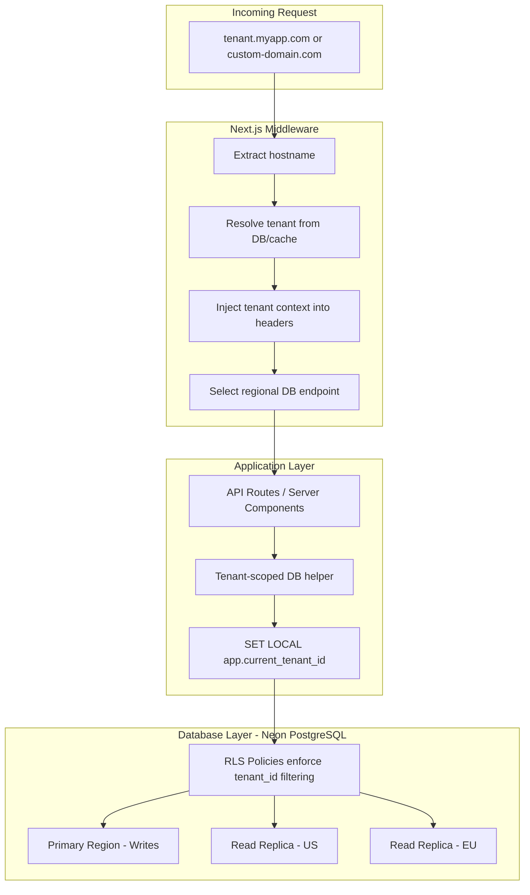

# Multi-Tenancy with RLS, Custom Domains, and Regional Routing

> **Preview note:** This file lives in `docs/`. If the diagram below shows as raw code instead of a flowchart, use a viewer with Mermaid support (e.g. the "Markdown Preview Mermaid Support" extension in VS Code/Cursor). The original Cursor plan view also hides the YAML frontmatter and shows phase status in a custom UI—plain Markdown preview won’t match that.

## Architecture Overview



---

## Phase 1: Schema Changes and Tenant Tables

### 1.1 New tables in [src/db/schema.ts](src/db/schema.ts)

**tenants** table:

- `id`: uuid (PK, `gen_random_uuid()`)
- `name`: text (required)
- `slug`: text (unique, required) -- maps to subdomains
- `region`: text (default `'us-east-1'`) -- Neon region identifier
- `plan`: enum (`'free'`, `'pro'`, `'enterprise'`)
- `settings`: jsonb (nullable, for tenant-specific config)
- `isActive`: boolean (default true)
- `createdAt`, `updatedAt`: timestamps

**tenantDomains** table:

- `id`: uuid (PK)
- `tenantId`: uuid (FK -> tenants.id, cascade delete)
- `domain`: text (unique)
- `type`: enum (`'subdomain'`, `'custom'`)
- `isVerified`: boolean (default false)
- `verificationToken`: text (for DNS TXT record verification)
- `verifiedAt`: timestamp (nullable)
- `createdAt`: timestamp

**tenantMemberships** table:

- `id`: uuid (PK)
- `tenantId`: uuid (FK -> tenants.id)
- `userId`: integer (FK -> users.id)
- `role`: enum (`'owner'`, `'admin'`, `'member'`)
- `createdAt`: timestamp
- Unique constraint on (tenantId, userId)

### 1.2 Modify existing tables

Add `tenantId` (uuid, FK -> tenants.id, NOT NULL) to:

- `users` table in [src/db/schema.ts](src/db/schema.ts) -- line 27
- `reminders` table in [src/db/schema.ts](src/db/schema.ts) -- line 47

Add composite indexes:

- `idx_users_tenant` on `users(tenant_id)`
- `idx_reminders_tenant` on `reminders(tenant_id)`
- `idx_reminders_tenant_user_active` on `reminders(tenant_id, user_id, is_deleted, reminder_date)`

---

## Phase 2: Row-Level Security (RLS)

### 2.1 Switch to WebSocket adapter

The current neon-http adapter in [src/db/index.ts](src/db/index.ts) is stateless -- each query is a separate HTTP request, so PostgreSQL session variables (`SET`) don't persist. Switch to the **neon-serverless WebSocket adapter** which supports persistent connections and `SET LOCAL` within transactions.

**Changes to [src/db/index.ts](src/db/index.ts):**

```typescript
import { Pool } from "@neondatabase/serverless";
import { drizzle } from "drizzle-orm/neon-serverless";
import * as schema from "./schema";

const pool = new Pool({ connectionString: process.env.DATABASE_URL });
export const db = drizzle({ client: pool, schema });
```

Add `ws` package dependency (required for Neon WebSocket in Node.js).

### 2.2 Create RLS policies via migration

New SQL migration file in `drizzle/` (or a custom SQL script run post-migration):

```sql
-- Enable RLS on tenant-scoped tables
ALTER TABLE users ENABLE ROW LEVEL SECURITY;
ALTER TABLE reminders ENABLE ROW LEVEL SECURITY;

-- Force RLS even for table owners (important for safety)
ALTER TABLE users FORCE ROW LEVEL SECURITY;
ALTER TABLE reminders FORCE ROW LEVEL SECURITY;

-- Policies: filter rows by current tenant
CREATE POLICY tenant_isolation_users ON users
  USING (tenant_id = current_setting('app.current_tenant_id')::uuid);

CREATE POLICY tenant_isolation_reminders ON reminders
  USING (tenant_id = current_setting('app.current_tenant_id')::uuid);

-- Create a dedicated app role (not superuser) for the application
CREATE ROLE app_user NOLOGIN;
GRANT SELECT, INSERT, UPDATE, DELETE ON users, reminders TO app_user;
```

### 2.3 Tenant-scoped DB helper

New file: **src/db/tenant.ts** — wraps all tenant-scoped queries in a transaction that sets the RLS context:

```typescript
import { db } from "./index";
import { sql } from "drizzle-orm";

export async function withTenant<T>(
  tenantId: string,
  callback: (tx: typeof db) => Promise<T>,
): Promise<T> {
  return db.transaction(async (tx) => {
    await tx.execute(sql`SET LOCAL app.current_tenant_id = ${tenantId}`);
    return callback(tx);
  });
}
```

Every API route will use `withTenant(tenantId, (tx) => { ... })` instead of bare `db` queries. This gives **defense-in-depth**: application-level `WHERE tenant_id = ?` via Drizzle + database-level RLS as a safety net.

---

## Phase 3: Tenant Resolution and Middleware

### 3.1 Next.js Middleware

New file: **src/middleware.ts** (Next.js convention -- must be at project root or `src/`):

```typescript
import { NextRequest, NextResponse } from "next/server";

const APP_DOMAIN = process.env.APP_DOMAIN!; // e.g., "myapp.com"

export async function middleware(request: NextRequest) {
  const hostname = request.headers.get("host") ?? "";
  const tenant = await resolveTenant(hostname);

  if (!tenant) {
    return new NextResponse("Tenant not found", { status: 404 });
  }

  const headers = new Headers(request.headers);
  headers.set("x-tenant-id", tenant.id);
  headers.set("x-tenant-slug", tenant.slug);
  headers.set("x-tenant-region", tenant.region);

  return NextResponse.next({ request: { headers } });
}

export const config = {
  matcher: ["/((?!_next/static|_next/image|favicon.ico).*)"],
};
```

### 3.2 Tenant resolver with caching

New file: **src/lib/tenant-resolver.ts**

- Lookup by subdomain: extract slug from `{slug}.myapp.com`, query `tenants` table
- Lookup by custom domain: query `tenant_domains` where `domain = hostname AND is_verified = true`
- Cache results in-memory (Map with TTL) to avoid DB lookups on every request
- Falls back to 404 if no tenant found

### 3.3 Tenant context helper

New file: **src/lib/tenant.ts** — extracts tenant info from request headers (set by middleware):

```typescript
import { headers } from "next/headers";

export async function getTenantId(): Promise<string> {
  const h = await headers();
  const tenantId = h.get("x-tenant-id");
  if (!tenantId) throw new Error("Missing tenant context");
  return tenantId;
}
```

### 3.4 Update API routes

All routes in `src/app/api/` need to:

1. Call `getTenantId()` to get tenant from middleware-injected headers
2. Wrap DB operations in `withTenant(tenantId, ...)`
3. Include `tenantId` when inserting new rows

Example transformation for [src/app/api/users/route.ts](src/app/api/users/route.ts):

```typescript
export async function GET(_request: NextRequest) {
  const tenantId = await getTenantId();
  const currentUser = await withTenant(tenantId, async (tx) => {
    // RLS automatically filters to this tenant
    return tx.select().from(users).where(eq(users.isDeleted, false));
  });
  // ...
}
```

---

## Phase 4: Custom Domains

### 4.1 Domain management API

New routes under **src/app/api/tenants/domains/**:

- `POST /api/tenants/domains` -- add a custom domain, generate verification token
- `GET /api/tenants/domains` -- list domains for current tenant
- `POST /api/tenants/domains/[id]/verify` -- check DNS TXT record, mark verified
- `DELETE /api/tenants/domains/[id]` -- remove domain

### 4.2 DNS verification flow

When a tenant adds a custom domain:

1. Generate a random verification token (stored in `tenant_domains.verification_token`)
2. Instruct tenant to add a DNS TXT record: `_verification.custom-domain.com TXT "neon-verify=<token>"`
3. On verify request, use Node.js `dns.resolveTxt()` to check the record
4. If valid, set `is_verified = true` and `verified_at = now()`

### 4.3 Platform-level domain configuration

This is deployment-platform dependent. Since the platform isn't decided:

- **Vercel**: Use the Vercel Domains API to programmatically add/remove domains
- **Cloudflare**: Use the Cloudflare API for custom hostnames (Cloudflare for SaaS)
- **Self-hosted / Caddy / Nginx**: Dynamically update reverse proxy config

Document the interface so any provider can be plugged in:

```typescript
interface DomainProvider {
  addDomain(domain: string): Promise<void>;
  removeDomain(domain: string): Promise<void>;
  checkStatus(domain: string): Promise<"active" | "pending" | "error">;
}
```

---

## Phase 5: Regional Routing

### 5.1 Multi-region Neon setup

Neon supports **read replicas in different regions**. The approach:

- One primary database (e.g., `us-east-2`) for all writes
- Read replicas in other regions (e.g., `eu-west-1`, `ap-southeast-1`)
- Each tenant is assigned a `region` that determines their nearest read endpoint

### 5.2 Regional connection pool

New file: **src/db/regions.ts**

```typescript
const regionConnections: Record<string, Pool> = {};

export function getRegionalDb(region: string) {
  if (!regionConnections[region]) {
    const url =
      process.env[`DATABASE_URL_${region.toUpperCase().replace(/-/g, "_")}`];
    regionConnections[region] = new Pool({ connectionString: url });
  }
  return drizzle({ client: regionConnections[region], schema });
}

export function getPrimaryDb() {
  return getRegionalDb("primary");
}
```

Environment variables:

- `DATABASE_URL_PRIMARY` -- write endpoint
- `DATABASE_URL_US_EAST_1` -- US read replica
- `DATABASE_URL_EU_WEST_1` -- EU read replica

### 5.3 Read/write routing

Update `withTenant` to support read/write routing:

```typescript
export async function withTenant<T>(
  tenantId: string,
  region: string,
  callback: (tx: ...) => Promise<T>,
  options?: { write?: boolean }
): Promise<T> {
  const db = options?.write ? getPrimaryDb() : getRegionalDb(region);
  return db.transaction(async (tx) => {
    await tx.execute(sql`SET LOCAL app.current_tenant_id = ${tenantId}`);
    return callback(tx);
  });
}
```

Reads go to the tenant's nearest replica; writes always go to the primary.

---

## Phase 6: Auth Integration

Replace mock auth in [src/lib/auth.ts](src/lib/auth.ts) with real authentication:

- Integrate NextAuth.js or Clerk
- Include `tenantId` in the JWT/session claims
- Cross-verify: the tenant from the domain (middleware) must match the tenant in the user's token
- If mismatch, return 403 Forbidden

---

## File Change Summary

| Action | File                                                                                                             |
| ------ | ---------------------------------------------------------------------------------------------------------------- |
| Modify | `src/db/schema.ts` -- add tenants, tenant_domains, tenant_memberships tables; add tenant_id to users + reminders |
| Modify | `src/db/index.ts` -- switch to WebSocket adapter, support regional pools                                         |
| Modify | `src/db/seed.ts` -- seed tenant data                                                                             |
| Create | `src/db/tenant.ts` -- `withTenant()` helper                                                                      |
| Create | `src/db/regions.ts` -- regional connection management                                                            |
| Create | `src/middleware.ts` -- tenant resolution from hostname                                                           |
| Create | `src/lib/tenant-resolver.ts` -- domain-to-tenant lookup with caching                                             |
| Create | `src/lib/tenant.ts` -- extract tenant from request headers                                                       |
| Modify | `src/lib/auth.ts` -- replace mock auth, add tenant claim verification                                            |
| Modify | `src/app/api/users/route.ts` -- wrap in withTenant                                                               |
| Modify | `src/app/api/users/[id]/route.ts` -- wrap in withTenant                                                          |
| Modify | `src/app/api/reminders/route.ts` -- wrap in withTenant                                                           |
| Modify | `src/app/api/reminders/[id]/route.ts` -- wrap in withTenant                                                      |
| Modify | `src/app/api/me/route.ts` -- wrap in withTenant                                                                  |
| Create | `src/app/api/tenants/domains/route.ts` -- domain CRUD                                                            |
| Create | `src/app/api/tenants/domains/[id]/verify/route.ts` -- DNS verification                                           |
| Create | `drizzle/XXXX_add_tenancy.sql` -- RLS policies migration                                                         |
| Modify | `package.json` -- add ws dependency                                                                              |
| Modify | `drizzle.config.ts` -- update if needed for new migration approach                                               |
| Modify | `.env.example` -- add regional DB URLs and APP_DOMAIN                                                            |

---

## Implementation Order

The phases are designed to be implemented sequentially, as each builds on the previous. Phase 1-3 are the core and should be done first. Phase 4-5 can be done in parallel. Phase 6 (real auth) can be deferred but is strongly recommended before production.
